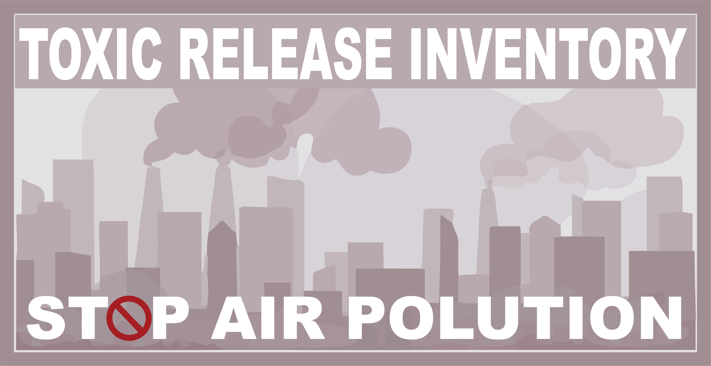

# STILT for TRI Modeling: 
All code is housed in the TRI_STILT Repo within the Hanson Lab Github. In order to run simulations properly, This repo must be cloned onto CHPC servers. Additionally, a separate folder must be initialized for STILT simulations. See the read_me in the TRI_STILT repo for setup. All code operates under the Linux Make system. In this form, all analysis should be repeatable utilizing the original TRI data. 

  

## Organization: 
Under the home directory, two folders should exist: 

1. STILT – a cloned directory to run all STILT simulations.
2. TRI_STILT – a cloned directory to handle all pre/post data processing and visualization
  
The TRI_STILT follows a specific template in order to keep the repo as clean as possible. Below is a summary and purpose of each folder/file: [TO DO]

## Setup: 
All steps create an environment on CHPC to run STILT simulations. 

1. CHPC (https://www.chpc.utah.edu/documentation/software/r-language.php)
    - login to chpc `ssh uXXXXXXXX@XXXXpeak.chpc.utah.edu`
    - Create a directory for modules (unless you already have one built)
        - `mkdir ./gl_modules`
    - Setup a custom R environment to download the required libraries
        - `module load R`
        - `mkdir -p ~/gl_modules/myR` (replace if you want, any env is fine except R!!)
        - `ls /uufs/chpc.utah.edu/sys/modulefiles/CHPC-18/Core/R/` (and look for the most recent version of R. Here will use )
        - `cp /uufs/chpc.utah.edu/sys/modulefiles/CHPC-18/Core/R/4.0.2.lua ~/gl_modules/myR/`
        - `mkdir -p ~/RLibs/4.0.2.lua` (creating a place to install any new libraries)
        - `vim ~/gl_modules/myR/4.0.2.lua`
            - add anywhere: 
            - `setenv("R_LIBS_USER",pathJoin("/uufs/chpc.utah.edu/common/home",os.getenv("USER"),"RLibs",myModuleVersion()))`
        - exit the terminal, reload then try: 
            - `module load myR`
        - To check the installation use `echo $R_LIBS_USER` and make sure this points to your RLibs

2. STILT (https://github.com/uataq/stilt)
    - Install the library
        - `install.packages(c("rslurm"),lib=c(paste("/uufs/chpc.utah.edu/common/home/",Sys.getenv("USER"),"/RLibs/",Sys.getenv("R_VERSION"),sep="")), repos=c("http://cran.us.r-project.org"),verbose=TRUE)`
        - `if (!require('devtools')) install.packages('devtools')`
        - `devtools::install_github('benfasoli/uataq')`
    - Create a project in the root directory
        - `Rscript -e  "uataq::stilt_init('my_folder_name',branch='hysplit-merge')"`
    - Test simulation (NECESSARY TO CONFIGURE ALL FILES)
        - `bash ./test/test_setup.sh`
        - `bash ./test/test_run_stilt.sh`

3. Create a python virtual environment  
    - Load the python version of interest
        - `which python (view current version of python)`
        - `module spider python`
    - Activate python 3.7
        - `module load python/3.7.3`
        - `which python` (should see a chpc origin)
    - Gather python3.7 and install with system site packages (this will create the virtual environment within gl_modules -- mystiltenv)
        - `python3.7 -m venv --system-site-packages ~/gl_modules/mystilt_env`
    - Launch the virtual environemnt
        - `module unload python/3.7.3`
        - `source ~/gl_modules/mystilt_env/bin/activate`
    - You should see the virtual environment active - see a (mystilt_env) [uxxxxx@kingspeak1:~]

4. TRI_STILT 
    - Install the Repo
        -`git clone https://github.com/Hanson-Research-Lab/TRI_STILT.git`
    - Navigate into the directory
    - Create the environment
        - `make clean` cleans the existing python caches
        - `make requirements` uses pip to install all requirements to run the src code

---
## Pre-Processing: 

1. **Clean Data:** 
    - `make data`
    - **Description**  Executes src/data/make_data.py. This script cleans and converts all TRI raw data into a single csv, with RSEI and Pubchem information attached. Change the inputs within the makefile as you deem fit for your project. For code details please visit src/data/make_data.py.
    - **Assumptions**
        1. Keeps only Fugitive and Stack Air Releases
        2. Removes any columns with over the threshold amount for missing data
        3. Keeps select columns of use: 'YEAR','TRIFD','FRSID','FACILITYNAME','CITY','COUNTY','ST','ZIP','LATITUDE','LONGITUDE','INDUSTRYSECTORCODE','INDUSTRYSECTOR','CHEMICAL','CAS#/COMPOUNDID','METAL','CARCINOGEN' ,'UNITOFMEASURE','51-FUGITIVEAIR','52-STACKAIR','INDUSTRYSECTORCODE','PRODUCTIONWSTE(81-87)'
        4. IARC does not exist for the following chemicals so they are filled accordingly.  
            - Strong-inorganic-acid mists containing sulfuric acid (see Acid mists) - CLASS 1 
            - Bis(2-ethylhexyl) phthalate (see Di(2-ethylhexyl) phthalate) - CLASS 2B
        5. Pubchem merge is conditionally dependent on all chemical files being present within the TRI_Pubchem_CIDS.csv file. If chemicals are not found, this step is skipped. Within the CIDS.csv several of the chemicals do not have an ID (Creosote, PCB, Sulfuric Acid (1994..) and METHYL ISOBUTYL KETONE). This indicates the chemical does not have a functional or easily defineable pubchem CID. 
        6. The primary purpose of the RSEI merge is to estimate stack height of fugitive releases
    - **Inputs (see makefile)**
        1. _Script to Run:_ src/data/make_data.py
        2. _Input Filepath_ - Path to TRI data. All TRI release files must be labeled as tri_YEAR_ut.csv.
        3. _Output Filepath_ - Path to export cleaned data. Note: only the label of the file is needed as the years of the simulation and csv are added to the export ie data/processed/test_clean will fill to data/processed/test_clean_1990_2018.csv.
        4. _Min Year_ - An integer filter to keep only tri releases from the min year on (>=)
        5. _Max Year_ - An integer filter to keep only tri releases from the max year and below (<=)
        6. _Threshold_ - Missing values threshold. Throws out any variables which have greater than that percentage of missing data. 0.2 ~ 20% of rows are missing within that column
        7. _IARC Path_ - Path to IARC chemical data 
        8. _Pubchem Path_ - Path to Pubchem path. NOTE: pubchem is linked via a pubchem ID to the name of the chemical. This file is done for chemicals from 1990-1999. If these simulations are run in the future, a user will need to edit this file to include pubchem IDs for all new chemicals. If information is not available for all chemicals, this step is skipped and no pubchem information is linked. 
        9. _RSEI Path_ - Path to RSEI data from the EPA. 
    - **Outputs** 
        1. Single csv file of name output_filepath_name_min_year_max_year.csv. I recommend placing this output within data/processed
---
2. **Convert to STILT Input Format:** 
    - `make stilt_inputs`
Pre-Processing: 
    1. make data
        a. Executes src/data/make_data.py. This script cleans and converts all TRI raw data into a single csv, with RSEI and Pubchem information attached, saved under the dedicated output filepath + ‘/TRI_base_process_90_99.csv’.  Change the inputs within the makefile as you deem fit for your project. For more information about the inputs, please view make_data.py.  
    2. make stilt_inputs
        a. Executes src/data/make_stilt.py. This script converts the TRI csv file, into a format agreeable with STILT. This code is still under revision. This outputs, two CSV files in the /data/processed folder – *_id_mappings.csv contains the original TRI releases with an id column. Since STILT simulations only calculate flux fields, no concentration data is needed to run simulations. In order to cut down the number of simulations run, a subset of unique YEAR, LAT, LONG and HEIGHT (indicitivate of stack vs fugitive) are run by STILT. These are denoted by the *_stilt_RUN.csv file. The mappings join the simulations back to their original releases is contained within *_id_mappings.csv. 
        b. *_stilt_RUN.csv must now be converted to an R file and expanded based upon the dates of interest. Once processed, this file is saved to ./stilt/data/receptors_XX.rds. 

[TO DO]
MAKE SURE EVERYTHING CAN RUN ON A COMPUTE NODE/BE SUBMITTED AS A SLURM JOB
WRITEUP POST PROCESSING PIPELINE read me

Running STILT
    1. First, a simulation .r file must be created based upon the hyperparameters of interest. This file is located within the /stilt/code/example_run.r. Change the parameters as necessary to fit the simulation. 
    2. Once configured, copy this file into the STILT working directories. This will overwrite the current run_stilt.r file.
        a. cd -- 
        b. cp ./TRI_STILT/stilt/code/example_run.r ./STILT/r/run_stilt.r
        c. cp ./TRI_STILT/stilt/data/receptors_XX.rds ./STILT/
    3. To run the simulations simply run:
        a. cd ./STILT/
        b. RScript ./r/run_stilt.r
    4. This automatically batches all data through SLURM and no configuration of a compute node/slurm job is necessary. 
    5. All outputs will become available in ./out/footprints/ as netcdf files

Post-processing:
{IN PROGRESS}

STILT Tuning:
Ben Fasoli, a member of the STILT development team recommended we examine the effect of chaning particles and smoothing levels to find a stable model. In order to do this, we are looking at several factors: 
    3. The plume area as determined by convex hull
    4. The mean distance between the source point and each particle
    5. The coeffecient of variation for the “foot” of all the particles. 	
Ben noted that these values should reach an “elbow” point where the model stabalizes and isn’t highly dependent on small changes in particles and smoothing. Greg is beginning to run these simulations and store metrics and visualization to distill these ideal parameters. Note that these parameters also enable comparison between simulations to guage how the shape is changing (IOU between two plumes) and how much stability there is on a cell to cell basis (COV)

Validation:
There exist some EPA sensors which monitor chemicals within the air back to 1990 and are within reasonable proximity to a TRI release. In order to boost the strength of our validation, we plan to model relevant TRI releases through 2018 with comparable EPA sensor data to validate how well our model estimates chemical concentration. {IN PROGRESS}